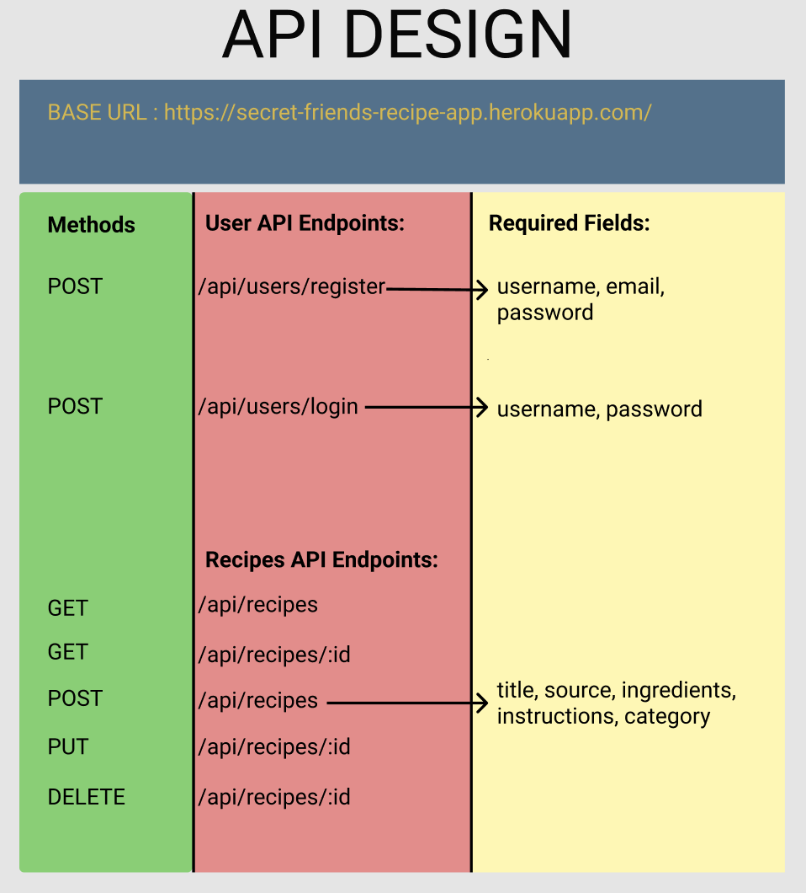
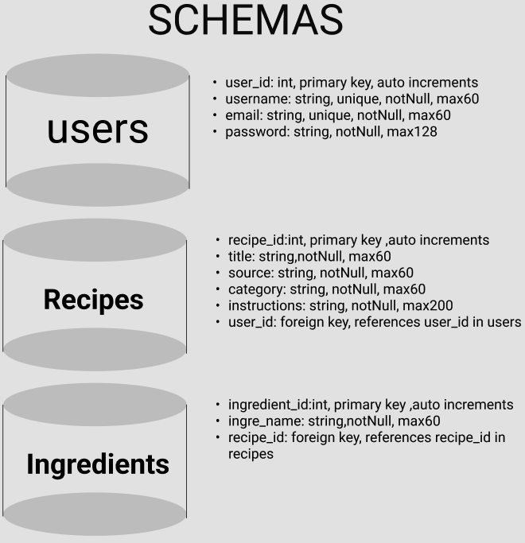

# Backend

## 🤟🏻**Pitch**

Anyone can go out and buy a cookbook these days, but I want a place to store all my secret family recipes, handed down from generation to generation.

The little cards my grandma wrote the recipes on in her beautiful cursive are getting lost or are hard to read. I need somewhere secure to keep my recipes with me at all times!

## ✅ **MVP**

1. On-boarding process for a new `user`

2. Ability to enter a new `recipe`, including `title`, `source` (ex: Grandma Ethel), `ingredients`, `instructions`, and `category` (dinner, chicken, dessert, pasta, etc) and edit or delete it later.

3. Homepage to view all entered `recipes`.

4. Ability to search for `recipes` by `title` or tagged `categories`.

## 👌 Base URL

https://secret-friends-recipe-app.herokuapp.com/

    
    

